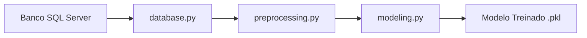

# 📊 Previsão de Inadimplência

[](https://www.python.org/)
[]()
[](https://github.com/psf/black)
[](https://flake8.pycqa.org/)
[]()

Projeto para construção de um **modelo preditivo de inadimplência**, desde a análise exploratória até a execução automatizada do pipeline em produção.

---

## 🎯 Objetivo

Desenvolver um modelo de Machine Learning capaz de prever a probabilidade de um cliente se tornar inadimplente, utilizando:

- Engenharia de atributos
- One-Hot Encoding
- Balanceamento da variável alvo (SMOTE)
- Regressão Logística
- Avaliação com ROC AUC e métricas de classificação

---

## 🏗 Arquitetura do Projeto



### Fluxo do Pipeline

1. 🔄 **Carregamento dos dados** do banco
2. 🧹 **Pré-processamento**
3. 🏗 **Engenharia de Features**
4. 🔢 **One-Hot Encoding**
5. ⚖ **Balanceamento da Target** (SMOTE)
6. 🤖 **Treinamento do Modelo**
7. 📈 **Avaliação**
8. 💾 **Salvamento do Modelo**

---

## 📁 Estrutura do Projeto

```
previsao-inadimplencia/
│
├── src/
│   ├── database.py
│   ├── preprocessing.py
│   └── modeling.py
│
├── notebooks/
│   └── analysis_data.ipynb
│
├── models/
│   └── modelo_inadimplencia.pkl
│
├── tests/
├── config/
├── main.py
├── requirements.txt
└── .env
```

---

## ⚙️ Tecnologias Utilizadas

- **Python** 3.13
- **Pandas** - Manipulação de dados
- **Scikit-learn** - Machine Learning
- **Imbalanced-learn** - SMOTE para balanceamento
- **Joblib** - Serialização de modelos
- **SQL Server** - Banco de dados (Docker)
- **Jupyter Notebook** - Análise exploratória

---

## 🐳 Banco de Dados (Docker)

O projeto utiliza SQL Server rodando em container Docker.

### docker-compose.yml

```yaml
version: "3.9"

services:
  sqlserver:
    image: mcr.microsoft.com/mssql/server:2022-latest
    container_name: sqlserver
    environment:
      SA_PASSWORD: ${SA_PASSWORD}
      ACCEPT_EULA: "Y"
    ports:
      - "1433:1433"
    volumes:
      - sqlserver-data:/var/opt/mssql
    restart: unless-stopped

volumes:
  sqlserver-data:
```

---

## 🔐 Variáveis de Ambiente (.env)

Crie um arquivo `.env` na raiz do projeto:

```env
DB_HOST=localhost
DB_PORT=1433
DB_USER=usuario_python
DB_PASS=sua_senha_segura
DB_NAME=modelos_preditivos

SA_PASSWORD=sua_senha_sa
```

> ⚠️ **Importante:** O arquivo `.env` não deve ser versionado no Git.

---

## 🚀 Como Executar o Projeto

### 1️⃣ Criar ambiente virtual

```bash
python -m venv .venv
```

**Ativar o ambiente:**

- **Linux / Mac:**
  ```bash
  source .venv/bin/activate
  ```

- **Windows:**
  ```bash
  .venv\Scripts\activate
  ```

### 2️⃣ Instalar dependências

```bash
pip install -r requirements.txt
```

### 3️⃣ Executar pipeline completo

```bash
python main.py
```

**O sistema irá:**

1. Conectar ao banco
2. Pré-processar dados
3. Aplicar One-Hot Encoding
4. Balancear com SMOTE
5. Treinar modelo de Regressão Logística
6. Avaliar desempenho (ROC AUC)
7. Salvar modelo em `/models`

---

## 📊 Métricas do Modelo

Exemplo de resultado obtido:

| Métrica | Valor |
|---------|-------|
| **ROC AUC** | ≈ 0.81 |
| **F1-Score** (classe inadimplente) | ≈ 0.90 |
| **Modelo** | Regressão Logística |
| **Balanceamento** | SMOTE (apenas treino) |

---

## 📓 Notebooks

### `analysis_data.ipynb`

Contém:

- ✅ Análise exploratória
- ✅ Tratamento de valores missing
- ✅ Criação de faixas de financiamento
- ✅ Testes de balanceamento
- ✅ Visualizações

---

## 🧠 Pipeline de Machine Learning

### Pré-processamento (`preprocessing.py`)

- Criação de variáveis derivadas
- Tratamento de datas
- Tratamento de valores ausentes
- One-Hot Encoding
- Separação de X e y

### Modelagem (`modeling.py`)

- Train/Test Split
- Aplicação de SMOTE
- Padronização com StandardScaler
- Regressão Logística
- Avaliação com ROC AUC
- Salvamento do modelo

---

## 🧪 Próximas Melhorias

- [ ] Implementar Cross-Validation
- [ ] Testar Random Forest / XGBoost
- [ ] Criar API com FastAPI
- [ ] Implementar monitoramento de modelo
- [ ] Deploy em nuvem

---

## 👩‍💻 Autor

Projeto desenvolvido para prática completa de Engenharia de Machine Learning, do banco de dados até produção.

---

## 📌 Versão

**v1.0.0** – Pipeline completo com SMOTE integrado

---

## 📄 Licença

Este projeto está sob a licença MIT. Consulte o arquivo `LICENSE` para mais detalhes.